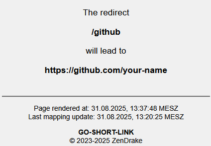

# Administration


This part of the documentation is meant for administrators and users of this software. It will explain how to configure
the software to run on different kinds of system configurations.

(installation)=
## Installation

The recommended way to install this server is by running it inside a Docker container. Pre-built images are provided for
Linux-based systems running `amd64`, `aarch64` and `rsicv` architectures. They are available from the GitHub Container
Registry and can be pulled via the following command:

```console
docker pull ghcr.io/fanonwue/go-short-link:master
```

However, it's recommended to set up a `compose.yml` for use with Docker Compose.

```yaml
services:
  app:
    image: ghcr.io/fanonwue/go-short-link:master
    restart: always
    env_file:
      - .env
    volumes:
      - ./data/fallback.json:/opt/app/fallback.json
      - ./secret:/opt/app/secret:ro
```

The application is configured by using environment variables. You can replace the `env_file` directive as seen in the above
compose file with an `environment` block if you do not wish to use an `.env` file. Please refer to the [configuration](#configuration)
section for further details on which options are supported.

In the `volumes` section, you can specify a fallback file to be used in case the primary source of links (for example,
Google Sheets) is temporarily unavailable. This is useful in case of a temporary outage, see [](#using-a-fallback-file)
for more information. 
The mapping `./secret:/opt/app/secret:ro`
is used to mount a secret directory containing the private key for the service account. This is required to access the
Google API. Refer to the [](#configuring-google-spreadsheets) section for more information.

## Building from source

In case you do not wish to run this application using Docker, it's possible to build it yourself. Please ensure that
the following prerequisites are installed on your system:

* [Go toolchain](https://go.dev/dl/), version 1.25 or newer
* Make (optional, but the example commands will make use of it)

To start, pull the repository using the following command:

```console
git pull git@github.com:fanonwue/go-short-link.git
```

The next step involves actually building the application. To simplify the build process, a Makefile is provided. For a
standard build, simply execute the command

```console
make build
```

and the compiled binary will be present in the `bin/` directory.

To customize the build, there are several environment variables you can set. Setting `TARGET=prod` will produce a binary
without any debug information and with stripped symbols, which will be significantly smaller. The Go toolchain itself also
provides useful options. If your system has C build tools installed (like `cc` or `clang`), the binary will not be statically
linked, but use dynamic linking to link to your installed `libc` library. You can disable this behavior by setting
`CGO_ENABLED=0`. This will produce a statically linked binary. If you wish to compile for a different platform, for example
Windows, you can make use of the `GOOS` and `GOARCH` environment variables.

To build a standalone, statically linked and stripped binary, you could use this command:


```console
CGO_ENABLED=0 TARGET=prod make build
```

To compile for Windows while running on a Linux-based system, this command can be used instead:


```console
GOOS=win CGO_ENABLED=0 TARGET=prod make build
```

The resulting binary in the `bin/` directory will be suffixed using the common `.exe` file extension common on Windows-based systems.

(configuration)=
## Configuration

The software can be configured using environment variables. Please refer to the [](#required-configuration-table)
table for a list of required variables you should set.

(required-configuration-table)=
:::{table} Common configuration variables
:widths: auto
:align: center
:class: multi-line-table

| Variable                             | Default                 | Description                                                                                                                                                                                                                     |
|--------------------------------------|-------------------------|---------------------------------------------------------------------------------------------------------------------------------------------------------------------------------------------------------------------------------|
| APP_ENV                              | dev                     | The environment the application runs in. For production systems, make sure to set this to "prod" or "production".                                                                                                               |
| APP_SERVICE_ACCOUNT_CLIENT_EMAIL     | ""                      | The client email of the service account to use. See [](#configuring-google-spreadsheets).                                                                                                                                       |
| APP_SERVICE_ACCOUNT_PRIVATE_KEY_ID   | ""                      | The ID of the used private key. This field is optional, as the Google API does not enforce it to be present. See [](#configuring-google-spreadsheets).                                                                          |
| APP_SERVICE_ACCOUNT_PRIVATE_KEY      | ""                      | The PEM-encoded private key. Line breaks must be escaped. Usage of this variable is discouraged. Consider using a key file instead. See [](#configuring-google-spreadsheets).                                                   |
| APP_SERVICE_ACCOUNT_PRIVATE_KEY_FILE | "secret/privateKey.pem" | Location of the PEM-encoded private key. See [](#configuring-google-spreadsheets).                                                                                                                                              |
:::

In addition to the above variables, the application supports several other configuration options. Please refer to the
[](#configuration-table) table for a list of all available options.

(configuration-table)=
:::{table} Additional configuration variables
:widths: auto
:align: center
:class: multi-line-table

| Variable                             | Default                 | Description                                                                                                                                                                                                                     |
|--------------------------------------|-------------------------|---------------------------------------------------------------------------------------------------------------------------------------------------------------------------------------------------------------------------------|
| APP_PORT                             | 3000                    | The port the server will listen on.                                                                                                                                                                                             |
| APP_UPDATE_PERIOD                    | 300                     | The period (in seconds) between updates.                                                                                                                                                                                        |
| APP_ENABLE_API                       | false                   | Whether to enable the API endpoints underneath the `/_api/` path.                                                                                                                                                               |
| APP_ADMIN_USER                       | ""                      | The username needed to access sensitive API and status endpoints. If left empty, access control will be disabled.                                                                                                               |
| APP_ADMIN_PASS                       | ""                      | The password needed to access sensitive API and status endpoints. If left empty, access control will be disabled.                                                                                                               |
| APP_FAVICON                          | ""                      | A comma separated list of favicons to include in non-redirect responses. If your redirections contain a redirect for `/favicon.ico`, you could set this value to `favicon.ico`. The client will be redirected to the real icon. |
| APP_ALLOW_ROOT_REDIRECT              | true                    | Whether to allow redirects without any given path. See [](#special-redirection-names-table).                                                                                                                                    |
| APP_IGNORE_CASE_IN_PATH              | true                    | If true, redirection names are handled in a case-insensitive manner.                                                                                                                                                            |
| APP_ENABLE_REDIRECT_BODY             | true                    | If true, a stub body will be generated when sending the redirection response, notifying the user of a redirection in case the browser does not honor the header.                                                                |
| APP_HTTP_CACHE_MAX_AGE               | APP_UPDATE_PERIOD * 2   | The duration (in seconds) in which the response shall be cached by the client.                                                                                                                                                  |
| APP_SHOW_SERVER_HEADER               | true                    | If true, the `Server` header in the response will be set to `go-short-link`. It will not be set at all otherwise.                                                                                                               |
| APP_ENABLE_ETAG                      | true                    | Whether to generate an Etag value for the response header.                                                                                                                                                                      |
| APP_SHOW_REPOSITORY_LINK             | false                   | If true, non-redirect responses will contain a link to the GitHub repository.                                                                                                                                                   |
| APP_DISABLE_STATUS                   | false                   | If true, the endpoints underneath the `/_status/` path will be disabled.                                                                                                                                                        |
| APP_FALLBACK_FILE                    | ""                      | If set, a fallback file will be created at the specified path. If the server restarts and is unable to fetch a redirect mapping from the provider, that file will be loaded instead, containing the last known-good state.      |::
:::

(configuring-google-spreadsheets)=
## Configuring Google Spreadsheets

The default data source for this link shortener is a Google Spreadsheets document. This provides several administrative
advantages, such as:

* Easy management of redirection mappings
* Shareable management access
* Ability to store additional information about each redirection
* Automatic backup of the document (spreadsheets have an integrated version control system)
* Automatic synchronization between multiple devices

The server utilizes Google's APIs for access; therefore, appropriate access has to be granted. This is possible by using
the Google Cloud Console. Note that the usage of Google APIs is subject to Google's [Terms of Service](https://policies.google.com/terms).
The APIs this software is using do not require payment and do not consume any kind of credits.

Visit the [Google Cloud Console](https://console.cloud.google.com) and create a new project. Under **APIs and services**, add the **Google Sheets API**. This
API is mandatory. The **Google Drive API** is optional, and allows checking the last modification time of the spreadsheet.
Enabling it allows the server to skip querying the contents of the spreadsheet if it hasn't changed since the last retrieval.

To use the API, credentials are needed. An easy way to gain access to the Google API is by use of service accounts. Within
the **APIs and Services** section of the cloud console, navigate to the **Credentials** tab. This allows you to create new
service account credentials. Create a new service account with a name you prefer. It is not necessary to grant this
service account any permissions, as we will explicitly grant access to the spreadsheet later. Once created, the service
account will require setting up access keys. Open the configuration page of the newly created service account and create
a key. Select the **JavaScript Object Notation** option and continue. Your browser will ask you to save the file somewhere.
The file contains all necessary information to access the API, including the client email and the private key. Because of
that, it is recommended to save the file in a secure location and to keep it secret.

The application requires three values from the previously saved file:

* the client email (`client_email`)
* the private key (`private_key`)
* the private key ID (`private_key_id`)

You can set the client email and the private key ID via the environment variables `APP_SERVICE_ACCOUNT_CLIENT_EMAIL` as well
as `APP_SERVICE_ACCOUNT_PRIVATE_KEY_ID` respectively. The private key itself can be set via the environment variable
`APP_SERVICE_ACCOUNT_PRIVATE_KEY` too (keeping the escaped line breaks `\n` within the string), but this is discouraged.
Instead, you can place your private key into a secret file located at `./secret/privateKey.pem` (or whatever you configure
using the `SERVICE_ACCOUNT_PRIVATE_KEY_FILE` environmnent variable). The escaped line breaks (`\n`) can be replaced with actual
Unix-style line breaks, but the application will handle this as well if this step has not been taken.

Finally, you need to create a properly formatted spreadsheet. The server expects a table that is formatted like the one
shown in the following table.


| Redirection Name | Target              | Optional Column                  | ...                     |
|------------------|---------------------|----------------------------------|-------------------------|
| __root           | https://example.com | You could put a description here | and something else here |
| test-redirect    | https://github.com  |                                  |                         |


The first two columns are fixed, meaning the application expects column A to always be the redirection name, and column B
to always be the target. All other columns are not queried, and you can use them to add more information, like a description
or an automatically generated, copy-able link to those. For explanations on how the special names in the first column work, 
refer to the [special redirection names](#special-redirection-names) section.

As we are using a service account, you need to grant that service account access to the spreadsheet. This is done by simply
sharing the spreadsheet. Your created service account has an email attached to it, which should look similar to
`<service-account-name>@<project-name-and-id>.iam.gserviceaccount.com`. Using Google Spreadsheet's sharing function, you can
just share the document to the service account using it's email address. Read-only access is enough.

To determine the ID of the spreadsheet, navigate to the spreadsheet's URL. The ID is the part of the URL after the last slash.
For example, if the URL is `https://docs.google.com/spreadsheets/d/1234567890/edit#gid=0`, the ID is `1234567890`. Remember
to set the ID in the `APP_SPREADSHEET_ID` environment variable.

(using-a-fallback-file)=
## Using a fallback file

Using a fallback file lets the service keep working even if the primary source of links (for example, Google Sheets) is 
temporarily unavailable. You enable it by providing a file path in the application’s configuration. From then on, every 
time the application successfully pulls the latest redirects from the primary source, it saves a snapshot of those links to the 
fallback file on disk. If a later update attempt fails, because the sheet can’t be reached or returns an error, the application 
automatically loads the most recent snapshot from the fallback file and continues serving redirects without interruption.

This mechanism is useful in two situations. First, during normal operation it provides resilience against brief outages 
of the primary source. Traffic keeps flowing with the last known good set of links. Second, on startup it can “prime” 
the service if the primary source is down. The application can boot using the snapshot so users aren’t met with missing links. 
When the primary source becomes available again, the application resumes reading fresh data and overwrites the fallback file 
with the new snapshot.

A few practical notes help set expectations. The fallback file acts as a cache of the most recently applied mapping, 
so it’s only as current as the last successful update. If you disable the fallback or don’t configure a path, failures
to reach the primary source will cause updates to be skipped. Existing in-memory links will keep working until a restart, 
but a cold start may have no redirects. Because the file contains your full redirect list, store it in a location with 
appropriate access controls and include it in backups only if that aligns with your policy. If you ever need to seed the 
service without network access, you can pre-create the file with your desired redirects and point the application to it. On 
first run it will load that snapshot and serve it immediately.

As described in the [configuration](#configuration-table) table, the fallback file can be configured using the `APP_FALLBACK_FILE`
environment variable.


(special-redirection-names)=
## Special redirection names

The application supports several different, keyword-like special redirection names. Refer to the following
[](#special-redirection-names-table) table for an overview. In the examples, assume that the server is available via `https://redirect.example.com`.

(special-redirection-names-table)=
:::{table} Special redirection names
:widths: auto
:align: center
:class: multi-line-table

| Redirection Name | Meaning                                                                                                                                                                                                                                       |
|------------------|-----------------------------------------------------------------------------------------------------------------------------------------------------------------------------------------------------------------------------------------------|
| __root           | When calling the server with an empty path, this redirection will be used. In this example, calling `https://redirect.example.com` would trigger this redirection. Note that this requires `APP_ALLOW_ROOT_REDIRECT` to be enabled.           |
| \<hostname\>     | When the request's hostname matches a record and the path is empty, this redirection will be triggered. Assuming `<hostname>` is replaced with `https://redirect2.example.com`, calling that URL will trigger this record instead of `__root` |
| \<path\>+        | A path ending with a `+` will be treated as a request for redirection information. See [](#requesting-redirect-info) for more information on this behavior.                                                                                   |
:::

As these special names are part of the standard redirect mapping, they can be used in the same way as any other redirection.
That means, that setting up a redirection for `__root` will also trigger the redirection for `https://redirect.example.com/__root`.
So if the special redirection name is present in the path, it will be treated as a regular redirection.


## Application behavior

Assume you have the following redirections:

| Redirection Name | Target                            |
|------------------|-----------------------------------|
| github           | https://github.com/your-name      |
| test-redirect    | https://example.com/test-redirect |

The server is available via `https://redirect.example.com`. The following section will explain the behavior of the server
in different scenarios.

Please note that dark-mode settings will be honored when rendering the pages,
but they have been disabled for demonstration purposes.

### Requesting a redirection

Simple: the server will redirect the client to the target URL. For example, accessing `https://redirect.example.com/github`
will result in a redirect to `https://github.com/your-name`. This redirection is done via the `Location` header. If enabled
via the `APP_ENABLE_REDIRECT_BODY` configuration option, the server will also return a stub body containing a message
indicating that the redirection has been triggered to server as a fallback for clients that do not honor the `Location`
header.

### Requesting a non-existent redirection

If you request a redirection that does not exist, the server will return a `404 Not Found` response. An appropriate error page will be
returned, containing some information for the client. Accessing `https://redirect.example.com/non-existent` will
result in such a response. The resulting page will look similar to the following:


:::{collapse} Page source
:class: collapse
```{literalinclude} assets/404-page.html
:language: html
```
:::
<br>

(requesting-redirect-info)=
### Requesting redirect information

You can view information about a specific redirection by appending a `+` to the end of the path. For example,
accessing `https://redirect.example.com/github+` (notice the `+` at the end) will result in a page similar to the following:



:::{collapse} Page source
:class: collapse
```{literalinclude} assets/redirect-info-page.html
:language: html
```
:::
<br>